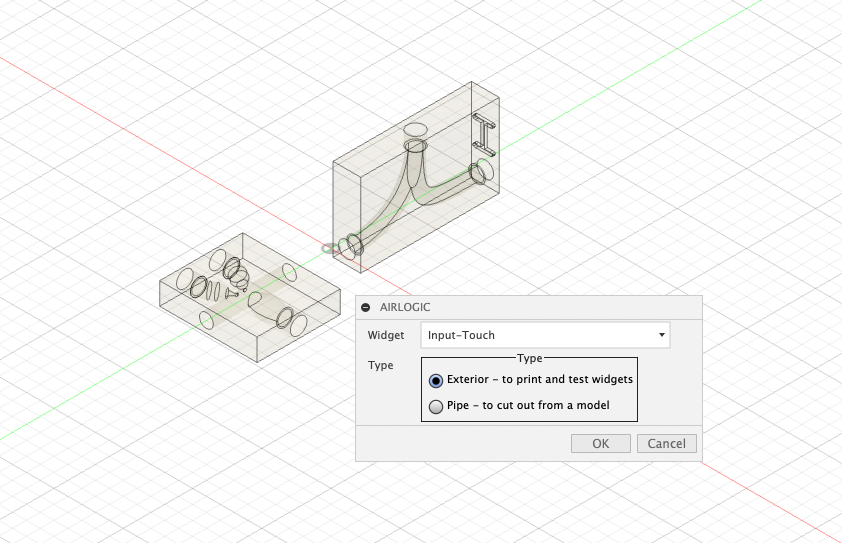
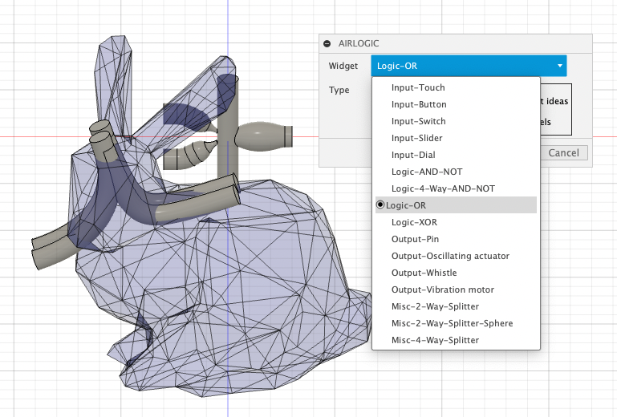
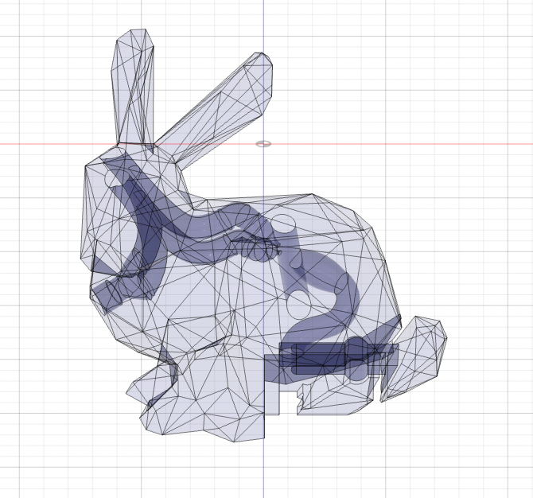

AirLogic is an HCI research project enabling fabrication of interactive objects without electronics. Objects fabricated with AirLogic can be powered by pressurized air such as blow from human lung or air from an air compressor. The project provides models of 3D printable logic gates, input sensors and output actuators. More information about the project will be added after publication.

## AirLogic script for Autodesk Fusion 360
The files under [AirLogic subfolder](./AirLogic) can be used in Autodesk Fusion 360. Fusion 360 software and an Autodesk account are required to use the script. Alternatively, the STEP files under [AirLogic/AirLogic/Resources/](./AirLogic/Resources/) can be directly downloaded and used in other 3D modeling software. 

### Features
The script has two features:

1) adding encapsulated version of the input, logic, output elements to the current workspace.  
It is to 3D print the elements and test ideas.

2) adding non-encapsulated versions (internal pipes) of the elements to the current workspace.  
Once users are happy with their ideas, they can embed the non-encapsulated versions of the elements into desired models (bunny in the below image). 

They can then manually connect the elements, cut out the elements from the desired models, and print.

## How to install the AirLogic script on Autodesk Fusion 360
1. Download and place [AirLogic subfolder](./AirLogic) under ~/Library/Application Support/Autodesk/Autodesk Fusion 360/API/Scripts/ (Mac).  
2. Launch Fusion 360.  
3. Go to Tools panel then click ADD-INS icon.  
4. Click MorpheesPlug Script under My Scripts.  
5. Click Run.  
6. Choose a widget and change the parameters as needed.  
Note: If you want to show the script icon on your Fusion 360, put the folder under ~/Library/Application Support/Autodesk/Autodesk Fusion 360/API/AddIns/ (Mac). An icon will show up under Tools/Add-ins arrow. You can click the icon to launch the script.  

## Authors
[Valkyrie Savage](https://valkyriesavage.com/), University of Copenhagen  
[Carlos E. Tejada](https://www.carlosetejada.com/), University of Copenhagen  
[Mengyu Zhong](https://katalog.uu.se/profile/?id=N21-194), University of Uppsala  
[Raf Ramakers](https://www.raframakers.net/), Hasselt University  
[Daniel Ashbrook](http://danielashbrook.com/), University of Copenhagen  
[Hyunyoung Kim](https://hyunyoung.kim/), University of Birmingham  
